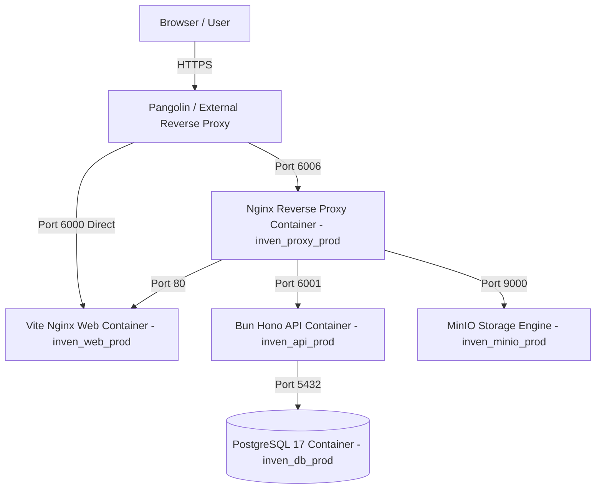

# 🌴 ระบบบัญชีคุมสินค้าเกษตรควบคุม (สพภ. 01 / 02) — Thai Government Inventory & Report System


เว็บแอปพลิเคชันบริหารจัดการสต๊อกคลังสินค้าและจัดทำรายงานสรุปประจำเดือน **แบบ สพภ. 01 และ สพภ. 02** ตามประกาศคณะกรรมการกลางว่าด้วยราคาสินค้าและบริการ (กกร.) กรมการค้าภายใน กระทรวงพาณิชย์ สำหรับผู้ประกอบการธุรกิจมะพร้าวผลอ่อนและน้ำมะพร้าวสด

---

## 📋 สารบัญ (Table of Contents)

1. [ภาพรวมและคุณสมบัติเด่น (Features)](#-ภาพรวมและคุณสมบัติเด่น-features)
2. [เทคโนโลยีและเครื่องมือ (Tech Stack & Skills)](#-เทคโนโลยีและเครื่องมือ-tech-stack--skills)
3. [กฎและมาตรฐานการพัฒนา (Development Rules - AGENTS.md)](#-กฎและมาตรฐานการพัฒนา-development-rules---agentsmd)
4. [กระบวนการทำงานตามกฎหมายราชการ (Thai Gov Inventory Workflow)](#-กระบวนการทำงานตามกฎหมายราชการ-thai-gov-inventory-workflow)
5. [การจัดสรรพอร์ตและสถาปัตยกรรม (Port Mapping & Architecture)](#-การจัดสรรพอร์ตและสถาปัตยกรรม-port-mapping--architecture)
6. [วิธีการติดตั้งและเริ่มต้นใช้งาน (Setup & Installation)](#-วิธีการติดตั้งและเริ่มต้นใช้งาน-setup--installation)
7. [ข้อควรระวังและความปลอดภัย (Security & Production Precautions)](#-ข้อควรระวังและความปลอดภัย-security--production-precautions)
8. [รายการคำสั่งที่มีประโยชน์ (Command Reference)](#-รายการคำสั่งที่มีประโยชน์-command-reference)

---

## 🌟 ภาพรวมและคุณสมบัติเด่น (Features)

* 📊 **Executive Dashboard:** แดชบอร์ดสรุปยอดคงเหลือ ตัวเลขสะสมรับซื้อ-จำหน่าย กราฟแนวโน้ม (Area Chart) และสัดส่วนสินค้า (Donut Chart) แสดงผลแบบ Compact Full-Height เลื่อนได้เฉพาะส่วนตาราง
* 📝 **Daily Stock Entry (สกกร. 01/02):** บันทึกธุรกรรมรับซื้อ จำหน่าย ใช้ผลิต และปรับปรุงยอดคลัง พร้อมป๊อปอัปฟอร์มที่ตรึงปุ่มบันทึกไว้ด้านล่างสุด (Pinned Footer) และระบบคัดเลือกเกษตรกร/คู่ค้า
* 📋 **Monthly Government Report Generator:** คำนวณและสรุปรายงานประจำเดือนอัตโนมัติ ส่งกรมการค้าภายในทุกวันที่ 5 ของเดือน พร้อมฟังก์ชัน Export Excel และ ZIP รายงาน
* 🏢 **Multi-Company & Multi-Warehouse:** รองรับการบริหารจัดการหลายบริษัท/ผู้ประกอบการในบัญชีเดียว (Multi-tenant) พร้อมระบบสลับบริษัทและคลังสินค้าเดี๋ยวนั้น
* 🎨 **Unlimited Dynamic Multi-Theme Presets:** ระบบสลับธีมสีและฟอนต์แบบไดนามิกผ่าน Dropdown Menu (สยามมรกต Emerald, Cloudflare Orange, WM Dev Custom, Ocean Blue, Violet, Amber, Slate)
* 👁️‍🗨️ **Stock Ledger History Dialog:** ป๊อปอัปตรวจสอบประวัติความเคลื่อนไหวสต๊อกย้อนหลัง แยกรายสินค้า ตรึงหัวตาราง และสรุปยอดคงเหลือยกมา-ยกไปที่ส่วนท้ายป๊อปอัป

---

## 🛠️ เทคโนโลยีและเครื่องมือ (Tech Stack & Skills)

### **Frontend App (`apps/web`)**
* **Core:** React 18, TypeScript, Vite
* **Styling & Components:** Tailwind CSS v4 (OKLCH Color Tokens), `shadcn/ui` UI Component Library, Lucide Icons, Recharts
* **State Management & Data Fetching:** Zustand (Client State), TanStack React Query v5 (Server State)
* **Routing & Forms:** React Router DOM v6, React Hook Form, Zod Resolver
* **Data Precision & Timezone:** `decimal.js` (คำนวณทศนิยมแม่นยำ 100%), `dayjs` (Timezone: `Asia/Bangkok`)

### **Backend API (`apps/api`)**
* **Runtime & Framework:** Bun Runtime, Hono Web Framework
* **Database & ORM:** PostgreSQL 17, Drizzle ORM, Drizzle Kit
* **Validation & Security:** Zod Schema Validation, Bun Password Hasher (Bcrypt Cost 10), Hono JWT Authentication
* **File Storage & Export:** AWS S3 SDK (MinIO S3 Compatible), XlsxPopulate, JSZip

### **DevOps & Infrastructure**
* **Containers & Proxy:** Docker, Docker Compose, Nginx Reverse Proxy, MinIO Storage Engine, Portainer UI

---

## ⚙️ กฎและมาตรฐานการพัฒนา (Development Rules - AGENTS.md)

การพัฒนาปรับปรุงโค้ดในโปรเจกต์นี้ต้องปฏิบัติตามกฎใน [AGENTS.md](file:///d:/work/inven-report-system/.agents/AGENTS.md) อย่างเคร่งครัด:

### 1. 🎨 กฎการพัฒนา Frontend (UI/UX)
* **บังคับใช้ `shadcn/ui` เท่านั้น:** ต้องใช้คอมโพเนนต์มาตรฐานจาก `shadcn/ui` ก่อนเสมอ (Button, Input, Select, Dialog, Table, ScrollArea ฯลฯ) ห้ามเขียน custom HTML component พื้นฐานเอง
* **การเลื่อนหน้าจอ (Scrolling):** เมื่อมีพื้นที่ที่ต้องเลื่อน ต้องหุ้มด้วย `<ScrollArea>` ของ `shadcn/ui` เสมอ ห้ามใช้ Native Browser Scrollbar ทรงหยาบ
* **การแสดงผลตาราง:** ต้องใช้ `<Table>` จาก `shadcn/ui` หรือ Common Shared DataTable Wrapper
* **การระบุสีและ Dark Mode:** ห้ามระบุรหัสสีแบบ Hardcode (เช่น `bg-white` หรือ `text-black`) ให้ใช้ CSS Variables ในรูปแบบ OKLCH และ Tailwind Utility Classes เช่น `bg-background`, `text-foreground` เพื่อรองรับ Dark Mode และการสลับธีม
* **โครงสร้าง Modular:** `App.tsx` ทำหน้าที่เป็นเพียง Router และ Global Provider Layout เท่านั้น (ความยาวไม่เกิน 150-200 บรรทัด) ห้ามรวมหน้าเพจใน `App.tsx` หน้าเพจหลักแต่ละหน้าต้องแยกเก็บไว้ใน `apps/web/src/pages/`

### 2. 🧮 กฎความถูกต้องและการคำนวณข้อมูล (Data Integrity)
* **ห้ามใช้ Float สำหรับเงินและปริมาณสต๊อกเด็ดขาด!**
  * ใน PostgreSQL: บังคับใช้ `DECIMAL(14,4)` สำหรับปริมาณสินค้า (Quantity) และ `DECIMAL(14,2)` สำหรับราคาต่อหน่วย (Price)
  * ใน Frontend: บังคับใช้ไลบรารี **`decimal.js`** ในการคำนวณเงินและทศนิยมเพื่อป้องกันปัญหา Floating Point Error
* **การจัดการโซนเวลา (Timezone):** การจัดการวันที่และเวลาทั้งหมดต้องใช้ `dayjs` ตั้งค่า Timezone เป็น **`Asia/Bangkok`** เสมอ
* **Data Validation:** ข้อมูลขาเข้าบน Backend ต้องตรวจสอบผ่าน Zod Schema เสมอ และฟอร์มบน Frontend ต้องใช้ `react-hook-form` ร่วมกับ `@hookform/resolvers` (Zod)

### 3. 🗄️ กฎฐานข้อมูลและ ORM (Drizzle ORM)
* **โครงสร้าง 3NF:** ทุกตารางต้องอยู่ในรูปแบบ Third Normal Form (3NF) มี `createdAt` และ `updatedAt`
* **Soft Delete:** บังคับใช้ระบบลบแบบนุ่มนวล โดยเพิ่มฟิลด์ `deleted_at` (`TIMESTAMPTZ`) ในตารางหลัก และคิวรีข้อมูลต้องกรองด้วย Helper `notDeleted` เสมอ

---

## 📜 กระบวนการทำงานตามกฎหมายราชการ (Thai Gov Inventory Workflow)

อ้างอิงคู่มือทักษะราชการ [thai-gov-inventory-workflow](file:///d:/work/inven-report-system/.agents/skills/thai-gov-inventory-workflow/SKILL.md):

1. **สินค้าควบคุมตามประกาศ กกร.:**
   * มะพร้าวผลแก่/ผลอ่อน: รับซื้อตั้งแต่ 10,000 ลูก/วัน หรือ 300,000 ลูก/เดือน ขึ้นไป
   * น้ำมะพร้าวสด: รับซื้อหรือแปรรูปตั้งแต่ 4 ตัน/วัน หรือ 120 ตัน/เดือน ขึ้นไป
2. **รอบการแจ้งรายงานประจำเดือน:**
   * ผู้ประกอบการต้องจัดส่งรายงานสรุปยอดปริมาณการรับซื้อ การจำหน่าย การแปรรูป และยอดคงเหลือ ณ วันสิ้นเดือน แก่กรมการค้าภายใน **ภายในวันที่ 5 ของเดือนถัดไป**
3. **โครงสร้างบัญชีคุม (สกกร. 01 / 02):**
   * **สกกร. 01:** บัญชีคุมรับซื้อ จำหน่าย และคงเหลือประจำวัน
   * **สกกร. 02:** บัญชีรายละเอียดรายชื่อคู่ค้า/เกษตรกรผู้ขายและผู้ซื้อสินค้าควบคุม

---

## 🔌 การจัดสรรพอร์ตและสถาปัตยกรรม (Port Mapping & Architecture)

ในสภาพแวดล้อม Docker ระบบถูกจัดสรรให้อยู่ในกลุ่มพอร์ต `600*` ดังนี้:



| Container Name | Service | Docker Port | Host Published Port |
|---|---|---|---|
| `inven_web_prod` | React / Vite Frontend | `80` | `6000` |
| `inven_api_prod` | Bun / Hono Backend API | `6001` | `-` *(Internal Network)* |
| `inven_proxy_prod` | Main Nginx Gateway Proxy | `6006` | `6006` |
| `inven_minio_prod` | MinIO Object Storage | `9000` (API), `9001` (Console) | `6007` (API), `6008` (Console) |
| `inven_db_prod` | PostgreSQL 17 Database | `5432` | `6009` |

---

## 🚀 วิธีการติดตั้งและเริ่มต้นใช้งาน (Setup & Installation)

### A. สำหรับ Local Development

```bash
# 1. Clone โค้ดจาก Repository
git clone https://github.com/kruntum/inven-report-system.git
cd inven-report-system

# 2. ติดตั้ง Dependencies ฝั่ง Web และ API
bun install

# 3. เริ่มต้นบริการ Database และ Storage ด้วย Docker
docker compose up -d db minio

# 4. รันบริการ API (Backend)
bun dev:api

# 5. รันบริการ Web (Frontend) ในอีก Terminal
bun dev:web
```

---

### B. สำหรับ Production Server Deployment (`https://coco.tummy.cc`)

```bash
# 1. สร้างโฟลเดอร์และ Clone โค้ดลงบน Server
mkdir -p /var/www/inven-report-system
cd /var/www/inven-report-system
git clone https://github.com/kruntum/inven-report-system.git .

# 2. สร้างไฟล์ .env.prod จากแม่แบบ
cp .env.prod.example .env.prod
nano .env.prod  # แก้ไข JWT_SECRET, POSTGRES_PASSWORD และ ALLOWED_ORIGINS

# 3. Build และเปิดบริการด้วย Docker Compose
docker compose -f docker-compose.prod.yml --env-file .env.prod up -d --build

# 4. สั่งสร้างตารางและนำเข้าข้อมูล Seed สต๊อกทั้งหมด
docker compose -f docker-compose.prod.yml exec api bun run db:push
docker compose -f docker-compose.prod.yml exec api bun run db:seed-prod
```

---

## 🔒 ข้อควรระวังและความปลอดภัย (Security & Production Precautions)

1. **JWT Secret Enforcement:** ในสภาพแวดล้อม Production (`NODE_ENV=production`) ระบบ Backend จะทำการตรวจสอบ `JWT_SECRET` หากไม่ได้ระบุในไฟล์ `.env.prod` ระบบจะหยุดการทำงานทันที (Crash Early) เพื่อป้องกันการแอบใช้คีย์รหัสผ่านดีฟอลต์
2. **CORS Origins Restriction:** ตรวจสอบว่าได้ใส่โดเมน Production ในตัวแปร `ALLOWED_ORIGINS` (เช่น `ALLOWED_ORIGINS=https://coco.tummy.cc`) เรียบร้อยแล้ว
3. **Pangolin / External Proxy Setting:** ใน Pangolin Proxy Manager ให้คงช่อง **Custom Host Header** เป็นค่าว่างหรือใส่ `coco.tummy.cc` และเปิดสวิตช์ **`Enable SSL`** เพื่อคุ้มครองความปลอดภัย HTTPS
4. **Git Security:** ไฟล์ `.env`, `.env.prod`, `pgdata` และ `minio_data` ถูกบล็อกด้วย `.gitignore` ห้าม Commit คีย์ความลับลง Public Repository เด็ดขาด

---

## 🛠️ รายการคำสั่งที่มีประโยชน์ (Command Reference)

| คำสั่ง | ตำแหน่งที่รัน | คำอธิบาย |
|---|---|---|
| `bun dev:web` | Root Directory | รัน Frontend Web (Vite Dev Server) |
| `bun dev:api` | Root Directory | รัน Backend API (Bun Hot Reload) |
| `bun run build` | `apps/web` / `apps/api` | ทดสอบ Build และคอมไพล์โค้ดฝั่ง Web / API |
| `bun run db:dump-prod` | `apps/api` | Export ข้อมูลจริงทั้งหมดใน DB ออกมาเป็นไฟล์ `seed_production.ts` |
| `bun run db:seed-prod` | `apps/api` | นำเข้าข้อมูล Seed เข้าสู่ฐานข้อมูล Production |
| `docker compose -f docker-compose.prod.yml build --no-cache web` | Server Root | สั่ง Rebuild คอนเทนเนอร์ Frontend ล่าสุดบน Server |
| `docker compose -f docker-compose.prod.yml restart proxy` | Server Root | รีสตาร์ตคอนเทนเนอร์ Nginx Reverse Proxy บน Server |

---

## 📄 License

ลิขสิทธิ์ระบบสงวนไว้สำหรับโปรเจกต์บัญชีคุมสินค้าเกษตรควบคุม (สพภ. 01 / 02) ตามกฎหมายกรมการค้าภายใน กระทรวงพาณิชย์
